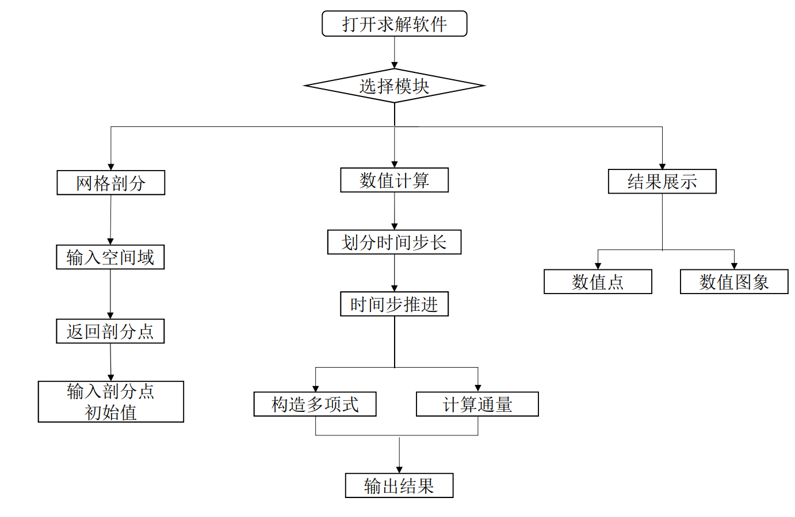

# Spectral Volume Method

## Contents
- [目标问题](#目标问题)
- [环境依赖](#环境依赖)
- [功能模块](#功能模块)
  - [计算模块](#计算模块)
  - [图形界面模块](#图形界面模块)
- [目录结构](#目录结构描述)

## 目标问题
* 一维空间双曲守恒律

$$
u_t+u_x=0
$$

* 一维空间Burgers方程

$$
u_t+u u_x=0
$$

* 二维空间双曲守恒律

$$
u_t+u_x+u_y=0
$$

## 环境依赖
* Python
* 环境配置
  * 需要安装numpy库：``pip install numpy``
  * 需要安装wxpython库：``pip install wxpython``
  
  
## 功能模块  

### 计算模块

* 对空间网格进行剖分：高斯点、高斯-拉道点、高斯-洛巴托点
* 使用谱体积法进行空间离散
* 使用龙格-库塔法进行时间离散

### 图形界面模块

* 方程选择窗口
* 参数输入窗口
* 网格剖分窗口
* 结果展示窗口

## 目录结构描述

├── test.py                      // 主程序  
├── UI     // 图形界面  
│  ├── Dialog.py  
│  ├── MyFrame.py  
│  ├── Panel.py  
├── SV FOR 1D // 一维空间求解器  
├   ├── result.txt  
├   ├── RK_solution.py  
├   ├── Division.py  
│   ├── division.txt  
├   ├── Error_calculation.py  
├   ├── SepctrlVolume_1D.py  
├   ├── SV1d.py  
├   L_operator.py  
├── SV FOR 2D // 二维空间求解器  
├   ├── Division.py  
├   ├── Error_calculation.py  
├   ├── L_operator.py  
├   ├── RK_solution.py  
├   ├── SepctrlVolume_2D.py  
├   ├── SV2d.py  
